# 云开发支持公众号示例DEMO

## 更新日期
- 2020年11月16日

## 项目介绍
目前云开发可以原生支持接收小程序客服消息，并通过云调用函数轻松回复。

2020年9月，云开发推出环境共享能力，支持小程序·云开发环境给公众号开发使用。

公众号网页开发以及各项有关公众号的云调用也上线支持

但是，由于在生态补全中，所以部分公众号的接口目前仍然不支持。

本示例主要展示在完全用云开发的条件下，如何构建支持公众号相应接口的接入开发，为之后推出的云调用能力做中转方案。

## 项目功能

- 接收公众号的用户发送消息，并支持被动回复消息
- access_token的获取和维护，无需自己重复开发
- 发送公众号模版消息能力

## 部署步骤

#### 一、准备资源和代码
- 选择已有或创建一个专用于支持公众号的云开发环境，推荐使用小程序·云开发（便于之后生态适应），获取云开发环境ID
- 下载该项目代码，推荐使用vscode打开，可通过安装cloudbase插件轻松管理资源。[详情](https://docs.cloudbase.net/vscode/intro.html)
- 打开cloudbaserc.json文件，将envId填写为自己选择的云开发环境ID（vscode使用时，注意登录和云开发环境属于一致账户）
- 上传functions文件夹下的call云函数到云开发环境中，选择云端安装依赖方式上传
  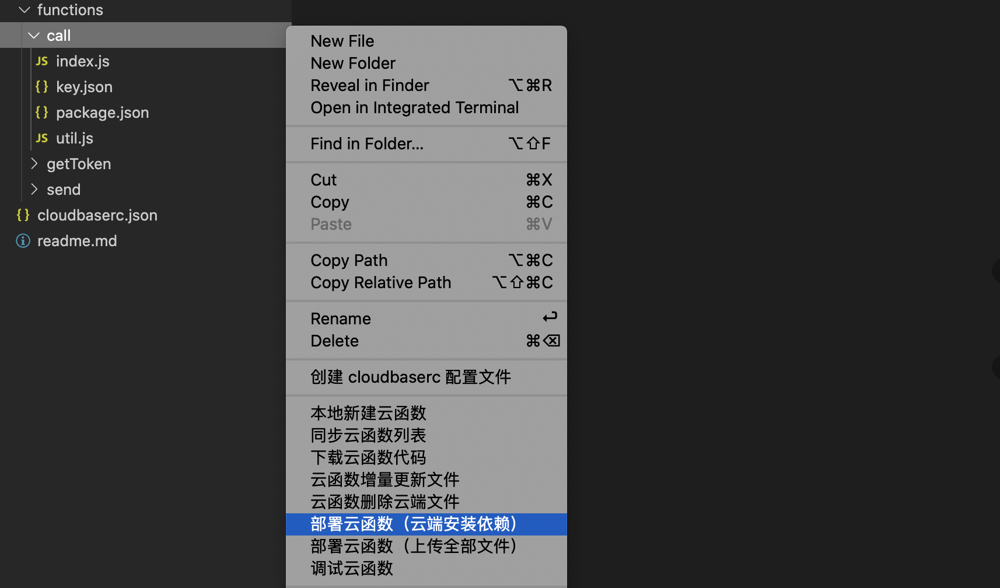
- 打开浏览器，访问腾讯云控制台，如果是小程序·云开发环境，则进入[此链接](https://cloud.tencent.com/login/mp?s_url=https%3a%2f%2fconsole.cloud.tencent.com%2ftcb%2fenv%2faccess),微信扫描网页中的二维码，选择云开发所在的小程序授权即可进入。如果是腾讯云·云开发环境，则进入[此链接](https://console.cloud.tencent.com/tcb/env/access),登录腾讯云账号即可
- 按照如下图所示，选择开发的云开发环境，新建云函数的http访问服务。（如果有业务需求，可以添加自定义域名）
  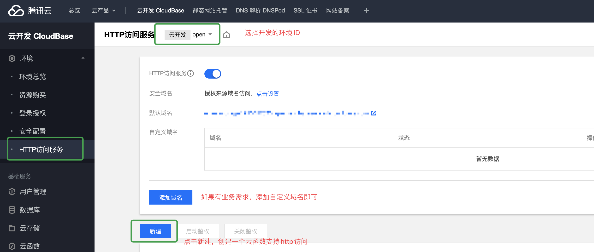
- 选择之前上传的call云函数，命名路径为/call（可以自定义，后续记得同步修改）
  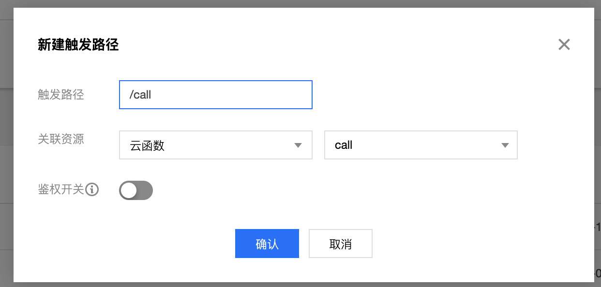

#### 二、配置公众号
- 登录公众号后台，进入开发栏目-基本配置，在服务器配置栏中，点击修改配置
  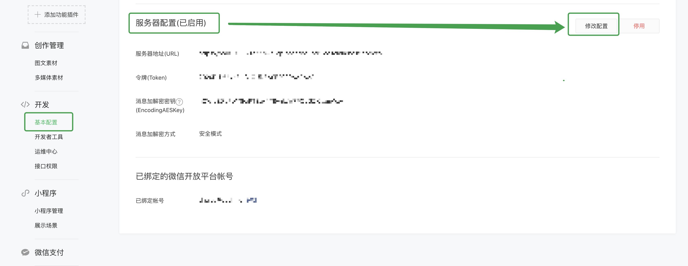
- 在配置页中，url填写上一步【http访问服务】中的默认域名+/call，或者是自定义的域名+/call（例如：https://a.cloudbase.com/call）
- Token随便填写一些字符即可，注意限制说明，AESkey点击随机生成即可，加密方式选择安全模式。
  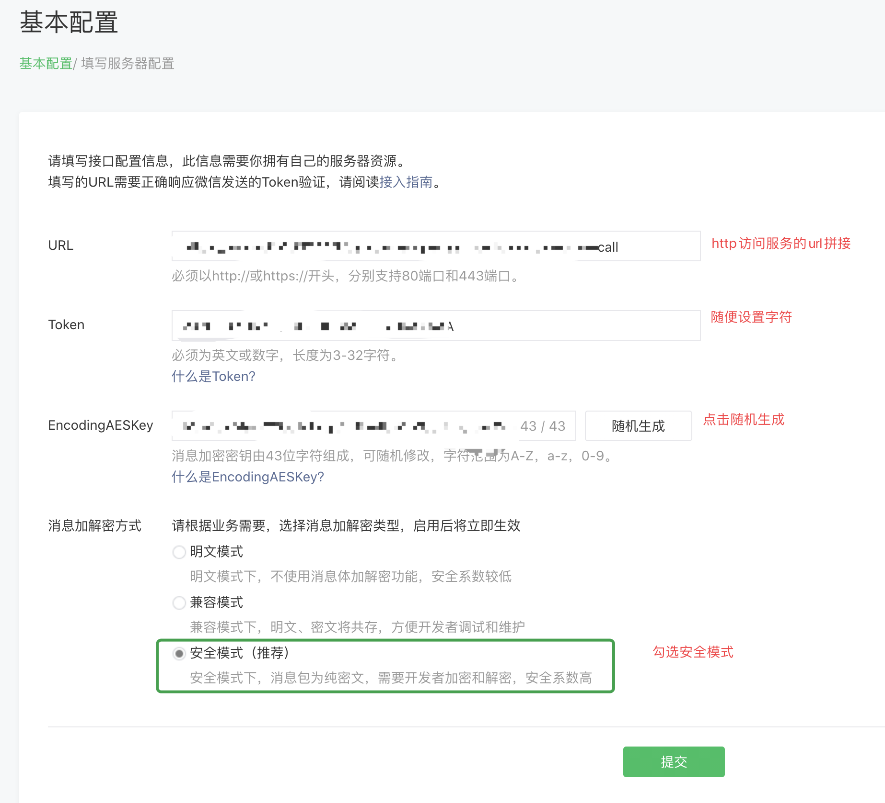
- 将以上设置的Token和AESkey保存下来，返回代码项目，将functions/call文件夹下的key.json中，填写完整设置的信息appId、encodingAESKey、token。
- vscode下在key.json处右键，选择【云函数增量更新文件】,将信息更新
  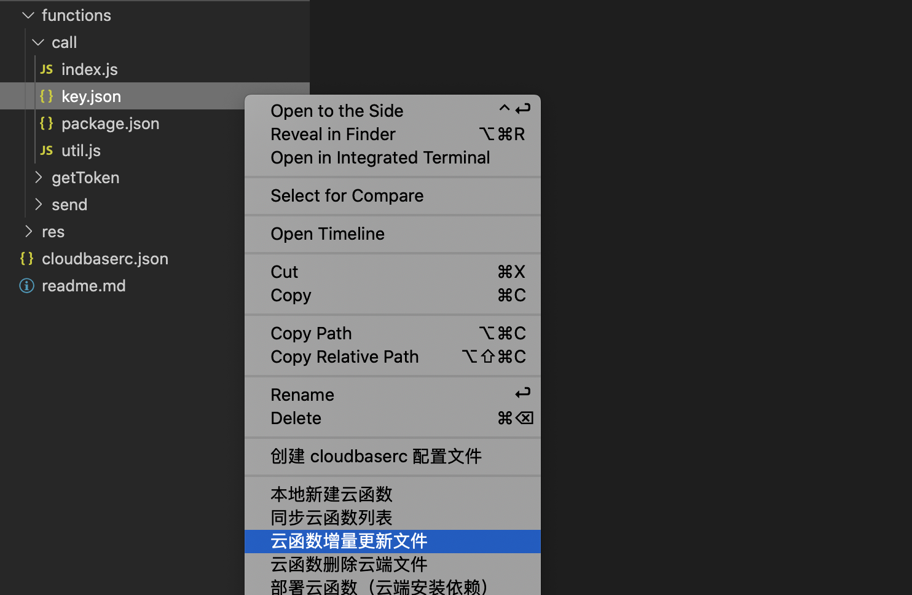
- 返回公众号设置页面，点击配置提交，微信服务器会进行自校验echo，就会提示通过。
- 至此，当用户关注公众号并发送任意消息，均返回收到【消息】，具体业务代码可以前往call/index.js中解读。
  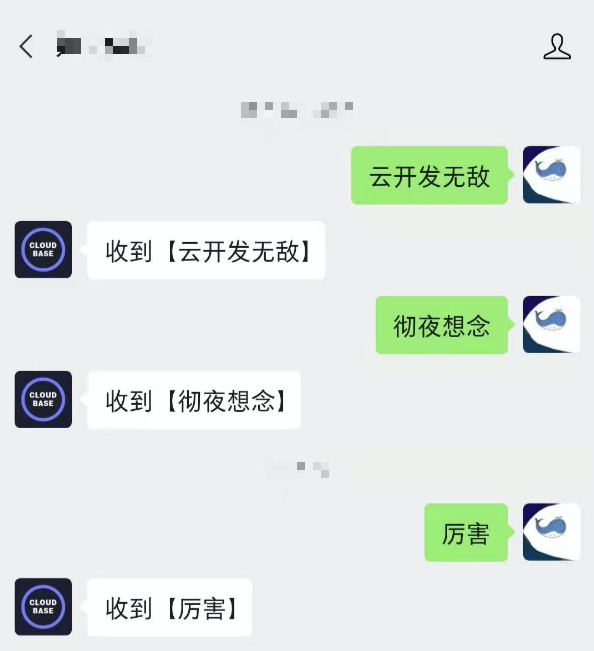

#### 三、配置access_token获取管理
- 进入公众号后台设置，仍在开发-基本设置，进入公众号基本开发信息，如果未使用过可以重试获取最新的key，如果有使用则可以用之前获取的，得到appid，secretkey。
  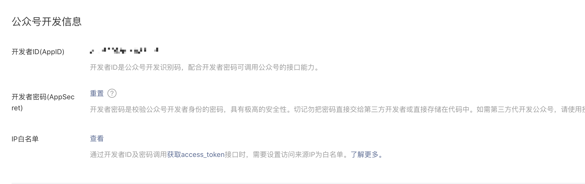
- 打开项目代码，functions/getToken/key.json，将相关信息写入，按照之前操作步骤上传getToken云函数。
- 前往云开发控制台-数据库，创建集合，名字为wxid。
- 前往云开发控制台-gettoken云函数配置页，开启固定ip，获取固定的ip地址
- 在公众号设置中，设置ip百名单为云函数的固定ip。
  
- 至此，你可以通过调用getToken云函数获取access_token，此云函数提供持续管理，如果超时则重新获取。

#### 四、配置模版消息发送
- 进入公众号后台，进入模版消息，点击申请模版，如果还未申请时，申请记得选择行业为IT科技-IT软件与服务
  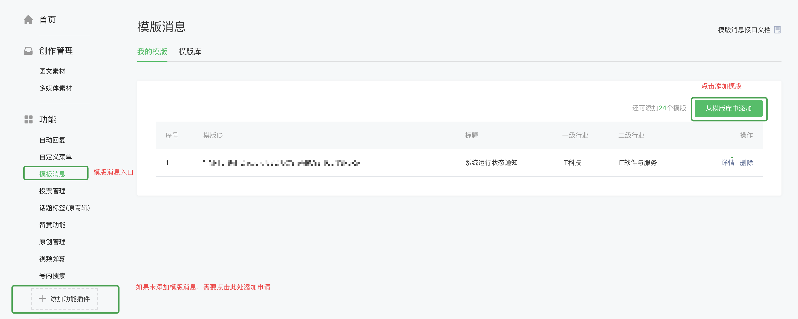
- 在模版中搜索，系统运行状态通知，选择模版。此为示例，与代码做了一致性编写，如果你想更改模版适应业务，记得去send云函数中修改相应的代码。
  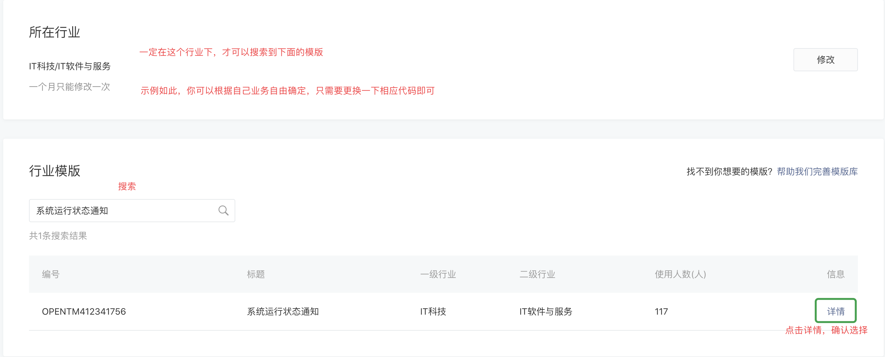
- 获取模版的id——templateId，将其填入项目下functions/send/key.json中templateId下
- 按照之前操作步骤上传send云函数。
- 至此，你完成了接入模版消息的过程，你可以通过调用send云函数，发送{oepnid,value}结构体控制发送模版消息。
- 在call云函数中index.js第47行代码，有整体调用方式，具体可按自己业务需求进行修改。
  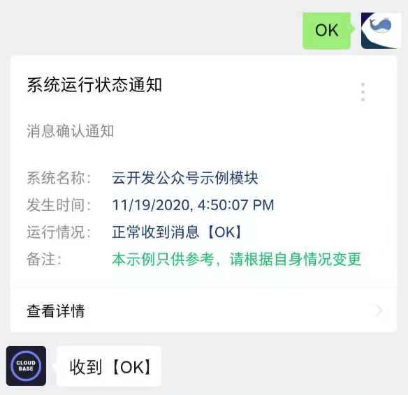

## 延伸探索
- 目前公众号部分接口仍然未原生支持到，你可以通过仿照send云函数，直接修改http.js的接口url来做相应接口实现即可，access_token通过getToken云函数获取。
  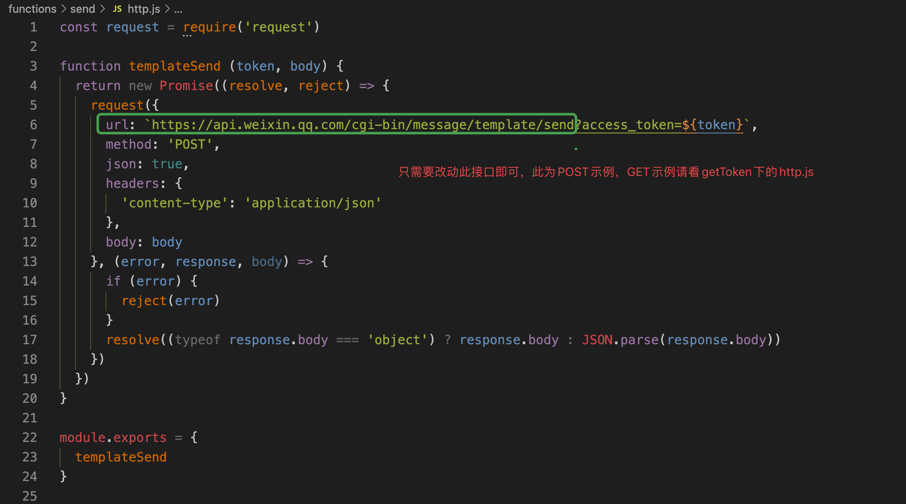

## 项目信息
- 作者：腾讯云云开发团队-zira
- 有效性：仅用于在云调用原生支持之前做中间方案，以最新更新为准
- 交流群：

